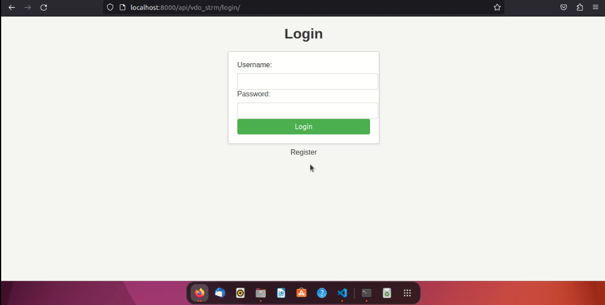
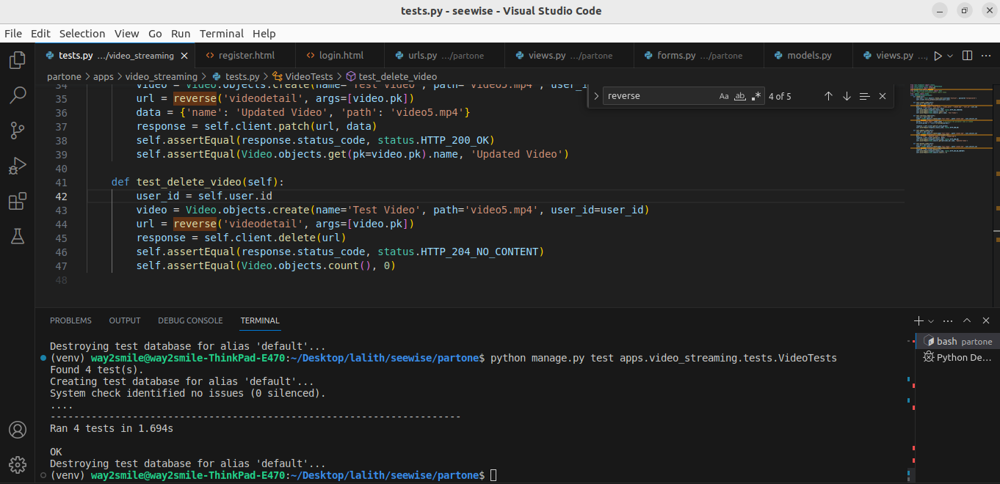

# Video Streamming Application

## Overview 
In this application we are streamming the video using Opencv multi-threading. each video execute the each thread.

## Steps to execute this repo
### Step 1:
Copy the repo link using below command

      git clone <repo_link>

### Step 2:
create the virtual env in your system 

      virtualenv <virutalenvname>

After created the virtualenv use the below commands to activate.

    <virtualenvname>/bin/activate

then, install the requirement packages.

    pip install -r requirements.txt

### Step 3:
Migrate the django models using below commands 

    python manage.py makemigrations
    python manage.py migrate

### Step 4: 
Use the below command to execute the application

    python manage.py runserver

### Step 5:
Using the below commands to test your applications model

    python manage.py test apps.video_streaming.tests.VideoTests

### Step 6:
Using the pylint to get the quality score of the code

    pylint <filename>

### Step 7:
Unit testing your application use this below code

    python manage.py test apps.video_streaming.tests.VideoTests

